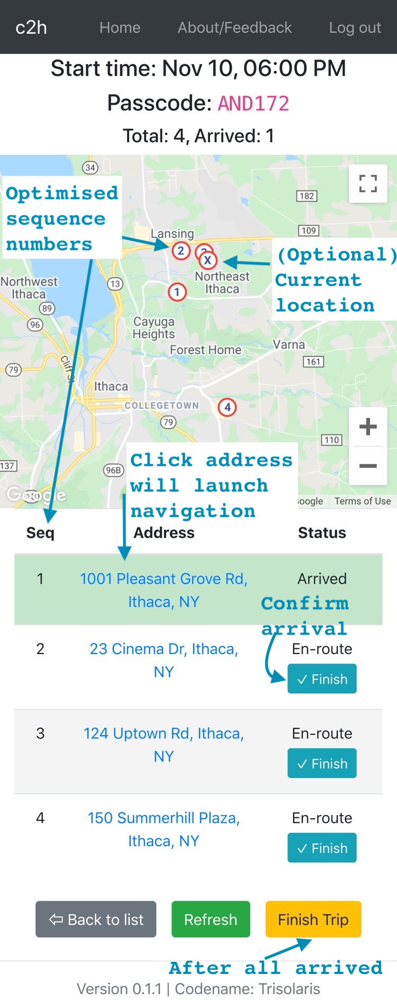
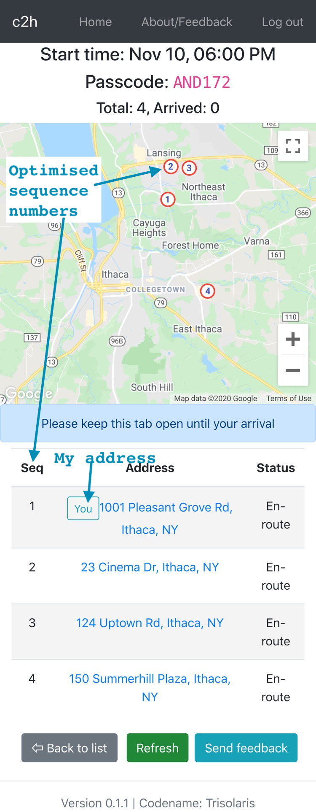

# Campus2home (c2h) Project

### About Campus2home Project

**Campus2home (c2h)** is my most recently finished project, a web app for Washington University Campus2home shuttle service. I'm the full-stack developer on this project.

Campus2home shuttle is the service to transport students and faculty from the campus to their home addresses. A key point is that the boarding location is fixed at one stop on campus, but the addresses of passengers are dynamic.

### Why build this project?

I've built this project to solve the existing drawbacks of the shuttle service, as follows.

| Drawback                                                     | Solution and effect                                          |
| ------------------------------------------------------------ | ------------------------------------------------------------ |
| **Lack of route optimisation:**  - Addresses are given in random order - Unnecessary detour often happens | **Route optimisation:**  - **Best/shortest route is dynamically calculated based on addresses** - Time saved: ~25min/trip |
| **Lack of information for passengers:**  - There is no way for passengers to know arrival sequence, causing some anxiety and uncertainty | **Transparency of information:**  - Both drivers and passengers can see the their sequence clearly on a map |
| **Inefficiency of information exchange:**  - When boarding, passengers are required to write info (names, addresses, boarding time, etc) on a physical clipboard - Upon arrival, drivers have to manually write confirmation (arrival time, etc) on clipboard | **Everything on phone/tablet:**  - The web app allows allows passengers to fill information directly on the phone simultaneously - Upon arrival, drivers only need to click one button to confirm arrival |
| **Public health concern:**  - Drivers/Passengers use the same clipboard | **Contactless:**  No more contact via clipboard    |

### Would like to try?

#### Open the web app

<a href="https://c2h.yueteng.me/" target="_blank">https://c2h.yueteng.me/ </a>**(Please follow the instruction below)**

#### Instructions

1.   You would need **2 browsers** (or open a new window in **Private Mode**)
     -   One for **driver**, one for **rider** (passenger)
     -   The web app is optimised for mobile device. If you're using desktop browser, it's recommenced to press `F12` key and choose a mobile device view (e.g. iPhone 6/7/8 Plus)
2.   On **Driver's** Window

     -   Click **`I'm a Driver`**
     -   Log in with the test account (Surname: **`Who`**, Given name: **`Doctor`**)
     -   Under "Create a new trip", click **`Create`**
     -   Enter a time (note: Only time near the current time will be valid), click `Create` and confirm
     -   Now as a driver, you've created a trip for riders to get aboard
     -   Notice a **unique passcode** in pink is displayed
3.   On **Rider's** Window
     -   Click **`I'm a Rider`**
     -   Under "Create a new trip", click **`Create`**
     -   Enter the **passcode** from your driver's window, and confirm the time
     -   Enter **`Surname`** and **`Given name`** (feel free to use random names)
     -   For **`Status`** and **`Station`** (feel free to choose any choice)
     -   Now it's time to enter address:
         -   For demo purposes, I've configured the map with its centre in Ithaca area and the starting point at Cornell campus.
         -   For you convenience, here are some testing addresses in Ithaca:
             -   `23 Cinema Dr, Ithaca, NY`
             -   `150 Summerhill Plaza, Ithaca, NY`
             -   `124 Uptown Rd, Ithaca, NY`
             -   `1001 Pleasant Grove Rd, Ithaca, NY`
         -   Choose one address and click **`Show on map`**. You should see a **red circle** marking the location. (You might need to zoom out/in)
         -   **Scroll down** and click **`Continue`** button
         -   (Optional) If you allow the page to access your location, a **red circle** with **`x`** will denote your approximate location
     -   After a few seconds, click **`Refresh`**, you should see the address is marked with sequence numbers `1`, `2`, etc
         -   ***This sequence shows the best/shortest route***
     -   Still from **Rider's view**, click **`Log out`**.
     -   Repeat the process with **different addresses**
     -   **You will be to see addresses are ordered with sequence numbers, based on optimised route**
         -   Both **Driver's and Rider's windows** can see this
         -   You might need to **click** `refresh` **button** to see updates) 
4.   On **Driver's Window**
     -   Click each **address** will launch navigation in Google Maps
     -   Click **`✓ Finish`** to confirm each rider has arrived
     -   Click **`Finish Trip`** to finish the current trip

### How did I build the project

The tech stack that I used to build this project is:

| Part                                           | Tech stack                                                   |
| ---------------------------------------------- | ------------------------------------------------------------ |
| Frontend                                       | - `React`                                                    |
| Backend (Core service)                    | - **APIs**: `Java` with `Spring` Framework - **Database ORM**: `Hibernate` |
| Backend (Route optimisation microservice) | - **Algorithm**: I wrote the algorithm code in `Python` based on *Held-Karp Algorithm* (Shortest path for Travelling Sales Person Problem) => <a href="https://en.wikipedia.org/wiki/Held%E2%80%93Karp_algorithm" target="_blank">Wiki page</a> - **APIs**: `Python` with `Django` Framework - **MQ & Task Scheduler**: `RabbitMQ` and `Celery` - **Deployment**: `Docker` container |

### GitHub repos of the project

-   Frontend: <a href="https://github.com/yuetenghu/washu-c2h-frontend" target="_blank">https://github.com/yuetenghu/washu-c2h-frontend</a>
-   Backend (Core service): <a href="https://github.com/yuetenghu/washu-c2h-backend" target="_blank">https://github.com/yuetenghu/washu-c2h-backend</a>
-   Backend (Route optimisation microservice): <a href="https://github.com/yuetenghu/dockerize-celery-django-app" target="_blank">https://github.com/yuetenghu/dockerize-celery-django-app</a>

### Screenshots

|                    **⬇ Driver's View ⬇**                     |                     **⬇ Rider's View ⬇**                     |
| :----------------------------------------------------------: | :----------------------------------------------------------: |
|  |  |
|                    **⬆ Driver's View ⬆**                     |                     **⬆ Rider's View ⬆**                     |

